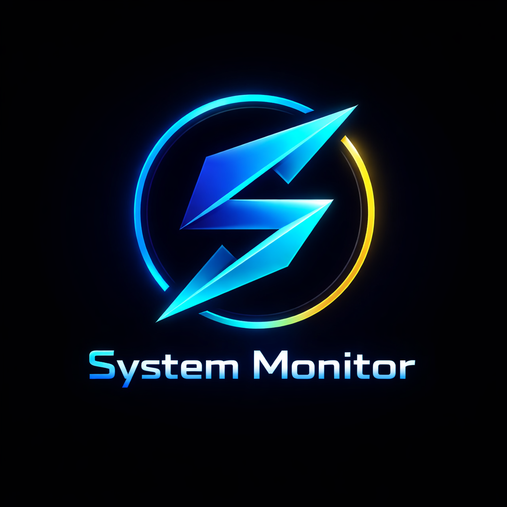
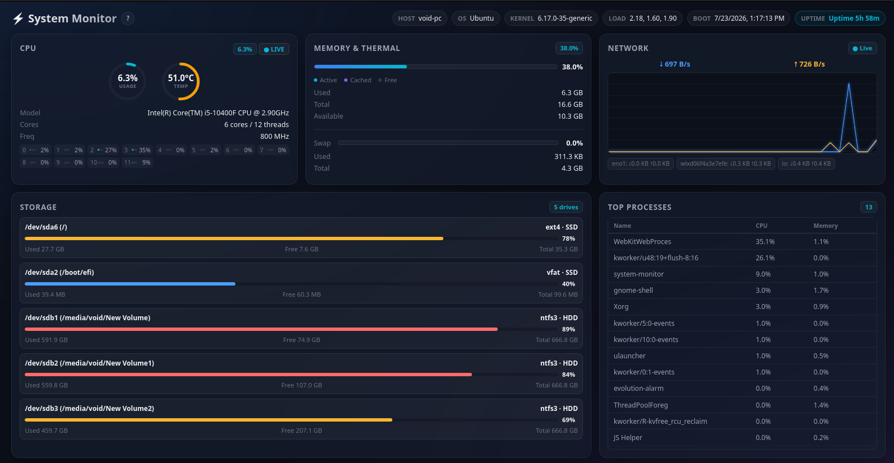

<p align="center">
  
</p>

<h1 align="center">System Monitor</h1>

<p align="center">
  <strong>A modern, lightweight and blazing-fast cross-platform system monitor built with Rust and Tauri.</strong>
</p>

<p align="center">
  Monitor your computer in real time with a clean native interface, low resource usage and detailed hardware statistics.
</p>

<p align="center">


</p>

---

<p align="center">
  
</p>

# ✨ Overview

**System Monitor** is a modern desktop application built using **Rust** and **Tauri v2** that provides fast, accurate and real-time system monitoring while consuming very little system resources.

Unlike many Electron-based alternatives, System Monitor focuses on **native performance**, **small size**, and **responsiveness** without sacrificing a polished user experience.

Whether you're checking CPU temperatures, monitoring RAM usage, tracking network activity or viewing running processes, System Monitor provides all essential information inside a clean and intuitive interface.

---

# 📸 Screenshot

<p align="center">
  
</p>

---

# 🚀 Features

### 🖥 CPU

- Live CPU usage
- CPU temperature
- CPU frequency
- CPU model information
- Individual core usage
- Thread count

### 💾 Memory

- Total RAM
- Used RAM
- Available RAM
- Cached memory
- Memory usage percentage
- Swap usage

### 💽 Storage

- Mounted drives
- Disk usage
- Free space
- Total capacity
- Filesystem type
- SSD/HDD detection

### 🌐 Network

- Live upload speed
- Live download speed
- Network activity graph
- Interface statistics

### ⚙ Processes

- Running processes
- CPU usage
- Memory usage
- Automatically sorted by CPU usage

### 📋 System Information

- Hostname
- Operating System
- Kernel Version
- System Load
- Boot Time
- Uptime

### 🎨 User Interface

- Modern dark theme
- Lightweight native rendering
- Responsive layout
- Live updating dashboard
- Smooth animations

---

# ⚡ Why Tauri?

System Monitor is powered by **Rust** and **Tauri**, providing several advantages over traditional desktop frameworks.

- Extremely low memory usage
- Small executable size
- Native performance
- Better startup speed
- Improved security
- Cross-platform support

---

# 📦 Supported Platforms

| Platform | Status | Package |
|-----------|:-----:|----------|
| Windows x64 | ✅ | `.exe`, `.msi` |
| Linux x64 | ✅ | `.AppImage` |
| Linux x64 | ✅ | `.deb` |
| Linux x64 | ✅ | `.rpm` |
| macOS ARM64 | ✅ | `.dmg` |
| macOS ARM64 | ✅ | `.app.tar.gz` |

---

# 📥 Installation

Download the latest release from the **Releases** page.

Choose the installer appropriate for your operating system.

Windows

- Setup (.exe)
- MSI Installer

Linux

- AppImage
- DEB
- RPM

macOS

- DMG
- APP Archive

---

# 🛠 Building From Source

## Requirements

- Rust
- Cargo
- Node.js
- npm
- Tauri CLI

Clone the repository

```bash
git clone https://github.com/mahan07dev/System-Monitor.git

cd System-Monitor
```

Install dependencies

```bash
npm install
```

Run in development

```bash
cargo tauri dev
```

Build release

```bash
cargo tauri build
```

---

# 🏗 Technologies

- Rust
- Tauri v2
- HTML5
- CSS3
- JavaScript
- sysinfo
- Native WebView

---

# 📈 Roadmap

## Completed

- [x] Live CPU Monitoring
- [x] CPU Temperature
- [x] RAM Monitoring
- [x] Swap Monitoring
- [x] Storage Monitoring
- [x] Network Monitoring
- [x] Process Viewer
- [x] System Information
- [x] Cross Platform Support

## Planned

- [ ] GPU Monitoring
- [ ] GPU Temperature
- [ ] Battery Information
- [ ] Fan Speed Monitoring
- [ ] SMART Disk Health
- [ ] Theme Customization
- [ ] Settings Page
- [ ] Export Statistics
- [ ] Historical Graphs
- [ ] Plugin Support

---

# 🤝 Website

The official project website is maintained separately.

🌐 **Website:** *(Coming Soon)*

Website developed and maintained by:

**YOUR_FRIEND_USERNAME**

---

# 👨‍💻 Author

Developed by

**Mahan07dev**

GitHub

https://github.com/mahan07dev

---

# ❤️ Acknowledgements

Special thanks to the Rust, Tauri and open-source communities for making projects like this possible.

---

# 📄 License

This project is licensed under the **MIT License**.

See the [LICENSE](LICENSE) file for more information.

---

# ⭐ Support

If you like this project, consider giving it a **Star** on GitHub.

It helps the project reach more people and supports future development.

---

<p align="center">

Made with ❤️ using <strong>Rust</strong> and <strong>Tauri</strong>

</p>